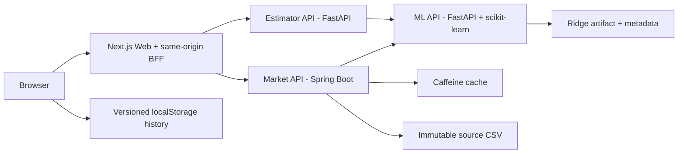

# Housing Price Full-Stack Interview Project

**English** | [简体中文](README.zh-CN.md)

A documentation-first, interview-ready housing price platform built from the supplied 50-row dataset. The project demonstrates reproducible machine learning, explicit HTTP contracts, Python and Java backend integration, a Next.js portal, containerized local execution, and a real Tencent Cloud deployment.

> This is a technical demonstration, not a commercial appraisal product or financial advice.

## Live Demo

- Housing portal: <https://kandian.site/housing>
- Source code: <https://github.com/VikiChan2021/housing-price-fullstack-interview>

## Current Status

Status last reviewed: **2026-08-19**.

| Area | Current status |
|---|---|
| Original task and source data | Archived, hashed, and kept immutable |
| Requirements, architecture, API, testing, and ADRs | Reviewed and accepted before implementation |
| Phase 0B engineering baseline | Complete and verified |
| Phases 1–4 application implementation | Complete with component/service acceptance |
| Phase 5 Docker Compose integration | Complete; build, health-based startup, shutdown, restart, smoke, and failure recovery verified |
| Local browser acceptance | Complete in real Chromium at 1280×800 and 360×800 |
| Tencent Cloud deployment | Deployed and fully browser-verified on 2026-08-15 |
| GitHub source delivery | Repository is published; the final post-documentation clean-clone replay is pending |
| Phase 6 delivery | In progress |

### Remaining delivery checks

- Run the complete stack from a fresh GitHub clone after the final documentation commit.
- Complete a timed 8–12 minute interview rehearsal.
- An independent axe accessibility scan has not been run; keyboard and semantic checks were completed.

The project is implemented, locally verified, and publicly deployed. It is not described as enterprise production-ready: authentication, rate limiting, centralized monitoring, high availability, formal backup, and an operational service-level objective remain outside this interview scope.

## Architecture



The browser never calls the ML API directly. `estimator-api` and `market-api` both call the same ML service over HTTP, keeping model inference in one place. Next.js Route Handlers provide a same-origin Backend for Frontend (BFF) for browser requests.

## Implemented Services

| Component | Technology | Responsibility |
|---|---|---|
| `web` | Next.js App Router, React, TypeScript | Shared portal, Estimator UI, Market UI, local history, comparison, Server Component loading, BFF routes, downloads |
| `ml-api` | Python, FastAPI, scikit-learn | Reproducible training, artifact loading, single/batch prediction, model information, range warnings, health/readiness |
| `estimator-api` | Python, FastAPI, HTTPX | Product-facing validation, ML orchestration, estimate metadata, stable dependency error mapping |
| `market-api` | Java 21, Spring Boot 3.4.4 | CSV loading, filters, statistics, pagination, segments, Caffeine caching, what-if calls, CSV/PDF export |

## Key Features

### Property Estimator

- Seven validated property inputs.
- Model-backed price estimate with model version and range warnings.
- Versioned browser-local history, limited to 20 records.
- Comparison of up to three saved estimates.
- Retryable dependency errors with `X-Request-ID`.

### Market Analysis

- Server-rendered initial summary, properties, and segments.
- Price, bedroom, area, year, school, and distance filtering supported by the API.
- Pagination, allowlisted sorting, and bedroom/year/price segments.
- Ordered baseline/scenario what-if prediction through the shared ML API.
- Bounded Caffeine summary cache with normalized keys.
- Real UTF-8 CSV and multi-page PDF exports.

### Reliability and Delivery

- Stable JSON error envelope and field-level validation errors.
- Bounded downstream timeouts with explicit 502/503/504 mappings.
- Request ID propagation across service boundaries.
- Separate health and readiness endpoints.
- Four Docker images with non-root runtime users and explicit memory limits.
- Nginx HTTPS path proxy under `/housing`; backend ports are loopback-only on the server.

## Model and Reproducibility

The final model is `Pipeline(StandardScaler, Ridge)`. The small dataset has strongly correlated features, and the original task requires model coefficients, so Ridge preserves a simple linear model while reducing coefficient instability.

| Item | Value |
|---|---|
| Training rows | 50 |
| Prediction rows | 10 |
| Model features | 7; `id` is excluded |
| Evaluation | Deterministic nested 5-fold cross-validation |
| Selected alpha | `0.1` |
| Model version | `ridge-v1-0e36c622-a05bac12` |
| R² | `0.984720 ± 0.004843` |
| MAE | `7378.35 ± 1481.66` |
| RMSE | `9311.09 ± 2144.91` |

The artifact metadata records feature order, coefficients, scaler statistics, training data SHA-256, training configuration SHA-256, dependency versions, evaluation protocol, metrics, and limitations. Inputs inside the API hard bounds but outside the observed training range are predicted with structured warnings.

## Technology Baseline

| Area | Frozen baseline |
|---|---|
| Python | Python 3.12.13, uv 0.11.32, FastAPI 0.139.2, scikit-learn 1.9.0 |
| Web | Node.js 24.18.0, pnpm 11.15.1, Next.js 16.2.12, React 19.2.8, TypeScript 5.9.3 |
| Java | Java 21, Spring Boot 3.4.4, Maven Wrapper 3.9.16 |
| Runtime | Docker Compose v2; base images are digest-pinned across all four Dockerfiles |

Direct dependencies are pinned, and transitive dependencies are controlled by `uv.lock`, `pnpm-lock.yaml`, and Maven dependency management. See [ADR-004](docs/adr/ADR-004-version-pinning.md) for the versioning decision.

## Repository Layout

```text
.
├─ apps/web/                  # Next.js portal, BFF routes, component tests
├─ services/
│  ├─ ml-api/                 # Training, runtime inference, FastAPI, tests
│  ├─ estimator-api/          # Product estimate API and ML HTTP client
│  └─ market-api/             # Spring Boot market analytics and exports
├─ packages/api-contracts/    # OpenAPI 3.1 snapshots and shared schemas
├─ data/raw/                  # Immutable supplied CSV files
├─ models/                    # Reviewable metadata; binary artifact is generated
├─ infra/
│  ├─ docker/                 # Shared Docker conventions
│  └─ tencent/                # Hosted environment and Nginx path proxy
├─ docs/                      # Requirements, architecture, ADRs, testing, operations
├─ references/original/       # Immutable original interview task
└─ compose.yaml               # Four-service local runtime topology
```

Generated dependencies, build outputs, model binaries, browser evidence, local environment files, logs, and IDE state are excluded from Git. See [`.gitignore`](.gitignore) and [`.dockerignore`](.dockerignore).

## Run Locally with Docker Compose

### Prerequisites

- Git.
- Docker Desktop or a compatible Docker Engine with Compose v2.
- Available local ports 3000, 8000, 8001, and 8080, unless overridden in `.env`.

No host installation of Python, Java, Node.js, Maven, or pnpm is required for the Compose path.

### Start

```powershell
docker compose config
docker compose up --build -d --wait
docker compose ps
```

### Local endpoints

| Endpoint | URL |
|---|---|
| Portal | <http://localhost:3000> |
| Web readiness | <http://localhost:3000/api/ready> |
| ML Swagger UI | <http://localhost:8000/docs> |
| ML API | <http://localhost:8000> |
| Estimator API | <http://localhost:8001> |
| Market API | <http://localhost:8080> |

### Minimal smoke check

```powershell
Invoke-RestMethod http://localhost:3000/api/ready
Invoke-RestMethod http://localhost:8000/health
Invoke-RestMethod http://localhost:8001/health
Invoke-RestMethod http://localhost:8080/health
Invoke-RestMethod http://localhost:8080/api/v1/market/summary
```

### Stop

```powershell
docker compose down
```

This removes the project containers and network; it does not delete source files or local images.

## Verification Summary

The last full local acceptance on **2026-08-15** recorded:

| Component | Result |
|---|---|
| ML API | 14 tests passed; 87.78% coverage; Ruff, strict mypy, OpenAPI validation, container and Swagger acceptance passed |
| Estimator API | 13 tests passed; 91.36% coverage; Ruff, strict mypy, OpenAPI and real ML HTTP integration passed |
| Market API | 14 Java tests passed; data, cache, HTTP failures, what-if, CSV and PDF verified |
| Web | 7 Vitest tests passed; ESLint, strict TypeScript and production build passed |
| Compose | Four images built; all services healthy; shutdown and clean restart passed |
| Browser | Estimator, Market RSC, filters, sorting, what-if, downloads, failure and recovery passed in real Chromium |

The browser acceptance checked DOM behavior, keyboard flow, console, network, downloads, and 1280×800/360×800 viewports. Expected 503/504 responses during failure injection were treated as intentional evidence, not normal-flow errors.

See the [test strategy](docs/testing/TEST_STRATEGY.md), [acceptance criteria](docs/requirements/ACCEPTANCE_CRITERIA.md), and [project status](docs/PROJECT_STATUS.md) for detailed evidence boundaries.

## Documentation Reading Order

1. [Contributor/agent instructions](AGENTS.md)
2. [Documentation index](docs/INDEX.md)
3. [Project requirements](docs/requirements/PROJECT_REQUIREMENTS.md)
4. [Acceptance criteria](docs/requirements/ACCEPTANCE_CRITERIA.md)
5. [System architecture](docs/architecture/SYSTEM_ARCHITECTURE.md)
6. [API contracts](docs/api/API_CONTRACTS.md)
7. [Data and ML design](docs/architecture/DATA_AND_ML_DESIGN.md)
8. [Implementation roadmap](docs/development/IMPLEMENTATION_ROADMAP.md)
9. [Test strategy](docs/testing/TEST_STRATEGY.md)
10. [Local run and deployment](docs/operations/LOCAL_RUN_AND_DEPLOYMENT.md)
11. [Interview demo runbook](docs/operations/INTERVIEW_DEMO_RUNBOOK.md)

## Original Materials

- [Original interview task PDF](references/original/Interview%20Tasks%20Fullstack.pdf)
- [Training dataset](data/raw/House%20Price%20Dataset.csv)
- [Prediction dataset](data/raw/Test%20Data%20For%20Prediction.csv)
- [Source inventory and SHA-256 hashes](references/README.md)

`data/raw/` and `references/original/` are immutable project inputs.

## Hosted Deployment

The housing portal runs in an isolated Compose project on Tencent Cloud. Nginx proxies only `/housing` and its descendants to the Web container on loopback port 13300. The Estimator, Market, and ML host ports are also bound to `127.0.0.1`; service-to-service traffic uses the private Compose network.

The deployment reuses the existing `kandian.site` TLS certificate and preserves the root application and existing `/api/` routes. Deployment steps, server environment placeholders, Nginx configuration, and rollback order are documented in [infra/tencent/README.md](infra/tencent/README.md).

## Limitations

- The model is trained on only 50 demonstration rows and is not suitable for real property valuation.
- Features are strongly correlated; individual coefficients must not be interpreted as causal effects.
- Important real-world variables such as location categories, condition, renovation, and transaction time are absent.
- Predictions outside observed training ranges are less reliable.
- Estimate history is stored only in the current browser.
- The Caffeine cache is in-process and intentionally disposable.
- The hosted stack is single-server and has no authentication, rate limiting, centralized observability, or high availability.

## Troubleshooting

Check failures from the deepest dependency outward:

1. `docker compose config` for environment interpolation.
2. `docker compose ps` for container health.
3. `docker compose logs ml-api`.
4. Estimator and Market health/readiness and logs.
5. Web readiness, browser Network, and browser Console.
6. Use `X-Request-ID` from the response or error body to correlate a failed request.

More detail is available in [Local Run and Deployment](docs/operations/LOCAL_RUN_AND_DEPLOYMENT.md).
