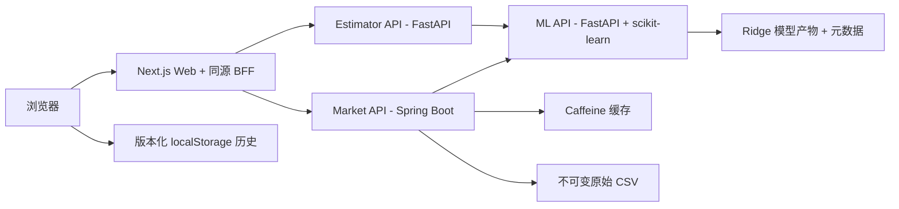

# 房价预测全栈面试项目

[English](README.md) | **简体中文**

这是一个文档先行、可用于面试演示的房价预测平台，基于题目提供的 50 行数据构建。项目展示了可复现机器学习、明确的 HTTP 契约、Python/Java 后端集成、Next.js Portal、容器化本地运行以及真实腾讯云部署。

> 这是技术演示项目，不是商业房产估价产品，也不构成金融建议。

## 在线演示

- 房价项目：<https://kandian.site/housing>
- GitHub 源代码：<https://github.com/VikiChan2021/housing-price-fullstack-interview>

## 当前状态

状态最后复核日期：**2026-08-19**。

| 区域 | 当前状态 |
|---|---|
| 原始题目与数据 | 已归档、记录哈希并保持不可变 |
| 需求、架构、API、测试和 ADR | 实现前已完成审查并接受 |
| Phase 0B 工程基线 | 已完成并验证 |
| Phase 1–4 应用实现 | 已完成组件与服务验收 |
| Phase 5 Docker Compose 集成 | 已完成；构建、健康依赖启动、关闭、重启、Smoke 和故障恢复均已验证 |
| 本地浏览器验收 | 已在真实 Chromium 的 1280×800 与 360×800 视口完成 |
| 腾讯云部署 | 2026-08-15 已部署并完成完整浏览器验收 |
| GitHub 源码交付 | 仓库已发布；最终文档提交后的干净克隆复跑仍待执行 |
| Phase 6 交付 | 进行中 |

### 剩余交付检查

- 最终文档提交后，从 GitHub 全新克隆并运行完整 Compose 验证。
- 完成一次 8–12 分钟计时面试彩排。
- 尚未执行独立 axe 无障碍扫描；键盘与语义检查已经完成。

项目已经实现、完成本地验证并真实公网部署，但不描述为企业级生产就绪：认证、限流、集中监控、高可用、正式备份和运行服务等级目标均不在本次面试范围内。

## 系统架构



浏览器不会直接调用 ML API。`estimator-api` 和 `market-api` 均通过 HTTP 调用同一 ML 服务，使模型推理保持唯一事实来源。Next.js Route Handlers 为浏览器提供同源 BFF（Backend for Frontend，后端为前端）。

## 已实现服务

| 组件 | 技术 | 职责 |
|---|---|---|
| `web` | Next.js App Router、React、TypeScript | 共享 Portal、Estimator UI、Market UI、本地历史、比较、Server Component 首屏、BFF、下载 |
| `ml-api` | Python、FastAPI、scikit-learn | 可复现训练、模型加载、单条/批量预测、模型信息、范围警告、Health/Readiness |
| `estimator-api` | Python、FastAPI、HTTPX | 产品级校验、ML 编排、Estimate 元数据、稳定下游错误映射 |
| `market-api` | Java 21、Spring Boot 3.4.4 | CSV 读取、筛选、统计、分页、分段、Caffeine 缓存、what-if、CSV/PDF 导出 |

## 核心功能

### 房产估价

- 7 个经过校验的房屋输入字段。
- 返回预测价格、模型版本和训练范围警告。
- 版本化浏览器本地历史，最多保存 20 条。
- 最多比较 3 条已保存估价。
- 带 `X-Request-ID` 的可重试依赖错误。

### 市场分析

- 服务端渲染初始摘要、房产列表和分段数据。
- API 支持价格、卧室、面积、年份、学校评分和距离筛选。
- 分页、白名单排序、卧室/年份/价格区间分组。
- 通过共享 ML API 一次有序批量预测 baseline/scenario。
- 使用规范化键的有界 Caffeine 摘要缓存。
- 真实 UTF-8 CSV 和多页 PDF 导出。

### 可靠性与交付

- 稳定 JSON 错误信封和字段级校验错误。
- 有上限的下游超时，以及明确的 502/503/504 映射。
- Request ID 跨服务传播。
- 独立 Health 与 Readiness 端点。
- 四个 Docker 镜像使用非 root 运行用户和显式内存上限。
- Nginx 通过 HTTPS 代理 `/housing`；服务器后端端口仅绑定回环地址。

## 模型与可复现性

最终模型是 `Pipeline(StandardScaler, Ridge)`。数据量很小且特征高度相关，同时原题要求提供模型系数，因此 Ridge 在保持简单线性模型的同时降低系数不稳定性。

| 项目 | 数值 |
|---|---|
| 训练数据 | 50 行 |
| 待预测数据 | 10 行 |
| 模型特征 | 7 个；排除 `id` |
| 评估方式 | 确定性 Nested 5-fold Cross-Validation |
| 最终 alpha | `0.1` |
| 模型版本 | `ridge-v1-0e36c622-a05bac12` |
| R² | `0.984720 ± 0.004843` |
| MAE | `7378.35 ± 1481.66` |
| RMSE | `9311.09 ± 2144.91` |

模型元数据记录特征顺序、系数、Scaler 统计、训练数据 SHA-256、训练配置 SHA-256、依赖版本、评估协议、指标和限制。位于 API 硬边界内、但超出训练观察范围的输入仍可预测，并返回结构化警告。

## 技术基线

| 区域 | 冻结基线 |
|---|---|
| Python | Python 3.12.13、uv 0.11.32、FastAPI 0.139.2、scikit-learn 1.9.0 |
| Web | Node.js 24.18.0、pnpm 11.15.1、Next.js 16.2.12、React 19.2.8、TypeScript 5.9.3 |
| Java | Java 21、Spring Boot 3.4.4、Maven Wrapper 3.9.16 |
| 运行环境 | Docker Compose v2；四个 Dockerfile 的基础镜像均固定 digest |

直接依赖使用精确版本，传递依赖由 `uv.lock`、`pnpm-lock.yaml` 和 Maven dependency management 控制。版本决策参见 [ADR-004](docs/adr/ADR-004-version-pinning.md)。

## 仓库结构

```text
.
├─ apps/web/                  # Next.js Portal、BFF 和组件测试
├─ services/
│  ├─ ml-api/                 # 训练、运行时推理、FastAPI 和测试
│  ├─ estimator-api/          # 估价业务 API 与 ML HTTP Client
│  └─ market-api/             # Spring Boot 市场分析与导出
├─ packages/api-contracts/    # OpenAPI 3.1 快照与共享 Schema
├─ data/raw/                  # 题目提供的不可变 CSV
├─ models/                    # 可审查元数据；二进制模型构建时生成
├─ infra/
│  ├─ docker/                 # Docker 共享约定
│  └─ tencent/                # 公网环境与 Nginx 子路径代理
├─ docs/                      # 需求、架构、ADR、测试和运行文档
├─ references/original/       # 不可变的原始面试题
└─ compose.yaml               # 四服务本地运行拓扑
```

生成依赖、构建产物、模型二进制、浏览器证据、本地环境文件、日志和 IDE 状态均不提交 Git。参见 [`.gitignore`](.gitignore) 与 [`.dockerignore`](.dockerignore)。

## 使用 Docker Compose 本地运行

### 前置条件

- Git。
- Docker Desktop 或兼容 Docker Engine，包含 Compose v2。
- 默认需要本地端口 3000、8000、8001、8080；可通过 `.env` 覆盖。

使用 Compose 路线时，不要求宿主机单独安装 Python、Java、Node.js、Maven 或 pnpm。

### 启动

```powershell
docker compose config
docker compose up --build -d --wait
docker compose ps
```

### 本地入口

| 入口 | URL |
|---|---|
| Portal | <http://localhost:3000> |
| Web Readiness | <http://localhost:3000/api/ready> |
| ML Swagger UI | <http://localhost:8000/docs> |
| ML API | <http://localhost:8000> |
| Estimator API | <http://localhost:8001> |
| Market API | <http://localhost:8080> |

### 最小 Smoke 检查

```powershell
Invoke-RestMethod http://localhost:3000/api/ready
Invoke-RestMethod http://localhost:8000/health
Invoke-RestMethod http://localhost:8001/health
Invoke-RestMethod http://localhost:8080/health
Invoke-RestMethod http://localhost:8080/api/v1/market/summary
```

### 停止

```powershell
docker compose down
```

该命令只移除本项目容器和网络，不会删除源文件或本地镜像。

## 验证摘要

最近一次完整本地验收完成于 **2026-08-15**：

| 组件 | 结果 |
|---|---|
| ML API | 14 项测试通过；覆盖率 87.78%；Ruff、严格 mypy、OpenAPI、容器和 Swagger 验收通过 |
| Estimator API | 13 项测试通过；覆盖率 91.36%；Ruff、严格 mypy、OpenAPI 和真实 ML HTTP 集成通过 |
| Market API | 14 项 Java 测试通过；数据、缓存、HTTP 故障、what-if、CSV/PDF 均已验证 |
| Web | 7 项 Vitest 测试通过；ESLint、严格 TypeScript 和生产构建通过 |
| Compose | 四镜像构建通过；全部服务 healthy；关闭与干净重启通过 |
| 浏览器 | 真实 Chromium 中的 Estimator、Market RSC、筛选、排序、what-if、下载、故障和恢复通过 |

浏览器验收检查了 DOM 行为、键盘流程、Console、Network、下载以及 1280×800/360×800 视口。故障注入期间预期出现的 503/504 属于主动验证证据，不是正常流程错误。

详细证据边界参见[测试策略](docs/testing/TEST_STRATEGY.md)、[验收标准](docs/requirements/ACCEPTANCE_CRITERIA.md)和[项目状态](docs/PROJECT_STATUS.md)。

## 文档阅读顺序

1. [协作与 Agent 说明](AGENTS.md)
2. [文档索引](docs/INDEX.md)
3. [项目要求](docs/requirements/PROJECT_REQUIREMENTS.md)
4. [验收标准](docs/requirements/ACCEPTANCE_CRITERIA.md)
5. [系统架构](docs/architecture/SYSTEM_ARCHITECTURE.md)
6. [API 契约](docs/api/API_CONTRACTS.md)
7. [数据与模型设计](docs/architecture/DATA_AND_ML_DESIGN.md)
8. [实施路线](docs/development/IMPLEMENTATION_ROADMAP.md)
9. [测试策略](docs/testing/TEST_STRATEGY.md)
10. [本地运行与部署](docs/operations/LOCAL_RUN_AND_DEPLOYMENT.md)
11. [面试演示手册](docs/operations/INTERVIEW_DEMO_RUNBOOK.md)

## 原始资料

- [面试官原始题目 PDF](references/original/Interview%20Tasks%20Fullstack.pdf)
- [训练数据](data/raw/House%20Price%20Dataset.csv)
- [待预测数据](data/raw/Test%20Data%20For%20Prediction.csv)
- [资料清单与 SHA-256](references/README.md)

`data/raw/` 与 `references/original/` 是项目不可变输入。

## 公网部署

房价 Portal 运行在腾讯云独立 Compose Project 中。Nginx 仅将 `/housing` 及其子路径代理到回环端口 13300 的 Web 容器。Estimator、Market 和 ML 的宿主机端口同样只绑定 `127.0.0.1`；服务间流量走私有 Compose 网络。

部署复用已有 `kandian.site` TLS 证书，原根应用和现有 `/api/` 路由保持不变。部署步骤、服务器环境变量示例、Nginx 配置和回滚顺序记录在 [infra/tencent/README.md](infra/tencent/README.md)。

## 局限

- 模型只基于 50 条演示数据，不能用于真实房产估价。
- 特征高度相关，单个系数不能解释为因果效应。
- 缺少真实市场中的地区类别、房屋状况、装修和交易时间等重要变量。
- 超出训练观察范围的预测可靠性更低。
- Estimate 历史只保存在当前浏览器。
- Caffeine 是进程内、可丢失缓存。
- 公网栈是单服务器部署，没有认证、限流、集中可观测性或高可用。

## 故障排查

按最深依赖向外排查：

1. 使用 `docker compose config` 检查环境变量替换。
2. 使用 `docker compose ps` 检查容器健康状态。
3. 查看 `docker compose logs ml-api`。
4. 检查 Estimator/Market 的 Health、Readiness 与日志。
5. 检查 Web Readiness、浏览器 Network 与 Console。
6. 使用响应头或错误体中的 `X-Request-ID` 关联失败请求。

更多步骤参见[本地运行与部署](docs/operations/LOCAL_RUN_AND_DEPLOYMENT.md)。
