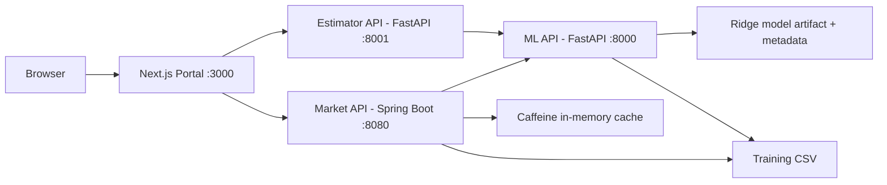
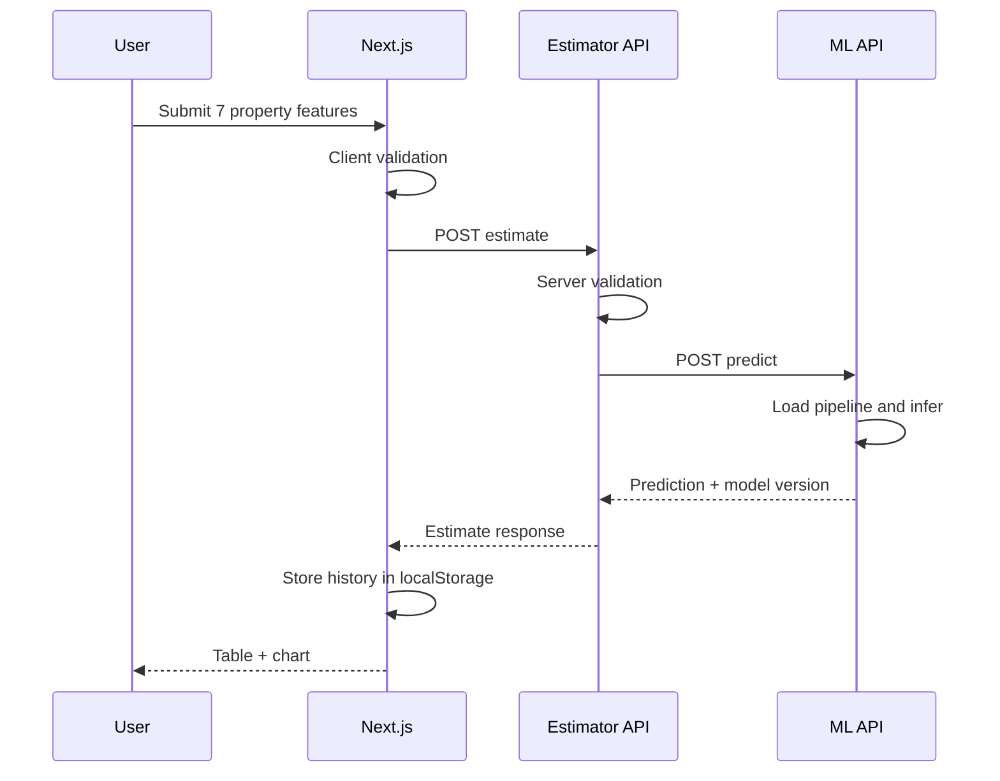
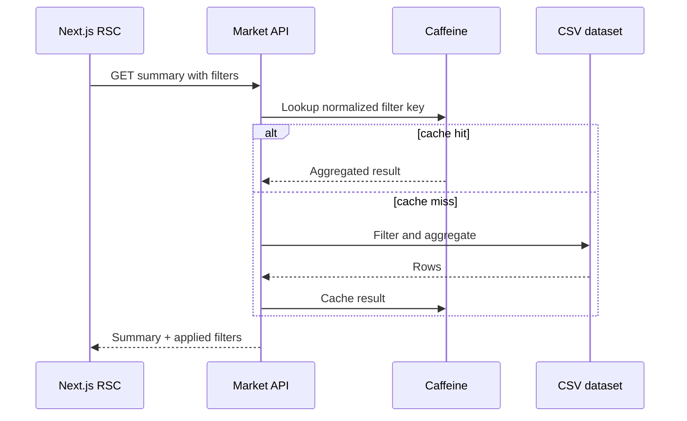

# 系统架构

## 1. 架构目标

- 严格体现 Next.js、Python/FastAPI、Java/Spring Boot 三类技术能力。
- 模型推理只有一个事实来源。
- 服务可独立测试，也可通过 Docker Compose 集成。
- 面试演示路径短、依赖少、故障可解释。

## 2. 逻辑架构

浏览器不直接访问 `ml-api`。Portal 通过 Next.js 服务端/BFF 路径访问业务后端，减少 CORS 暴露并集中处理用户可见错误。

## 3. 运行组件

| 组件 | 技术 | 职责 | 不负责 |
|---|---|---|---|
| `web` | Next.js App Router、Tailwind | 共享布局、页面、表单、图表、历史、比较、导出交互 | 模型训练、市场统计真相 |
| `ml-api` | Python 3.12+、FastAPI、scikit-learn | 加载模型、预测、模型信息、健康检查 | 页面、历史、市场聚合 |
| `estimator-api` | Python 3.12+、FastAPI | 估价业务校验、调用 ML、下游错误映射 | 复制模型推理、持久化用户数据 |
| `market-api` | Java 21、Spring Boot 3.4.4 | 数据读取、筛选、聚合、缓存、what-if 调用 | 训练模型、渲染页面 |

## 4. 服务通信

- 外部 API 路径统一带 `/api/v1`；健康检查可保留 `/health`。
- 服务间使用 JSON/HTTP，超时和重试必须有上限。
- 每个入口生成或传播 `X-Request-ID`。
- 错误响应遵循 [API 契约](../api/API_CONTRACTS.md) 的统一 envelope。
- 服务名通过环境变量配置，不在代码中写死 localhost。

## 5. 主要数据流

### 5.1 单套估价

### 5.2 市场分析

## 6. 状态与持久化

- 训练 CSV：版本化、只读输入。
- 模型产物：构建时或显式训练阶段生成，容器运行时只读加载。
- 估价历史：浏览器 `localStorage`，使用版本化 schema。
- 市场缓存：Java 进程内 Caffeine，短 TTL，可丢失。
- 无数据库、无分布式缓存。

## 7. 可用性与失败处理

| 故障 | 预期行为 |
|---|---|
| 模型文件缺失/损坏 | `ml-api` readiness 失败；预测不可用；错误日志明确 |
| ML 调用超时 | 业务后端映射为 504；Portal 提供重试 |
| ML 返回 4xx | 业务后端保留字段错误语义，不转换为 500 |
| CSV 无法读取 | `market-api` 启动失败或 readiness 失败，不返回空假数据 |
| 筛选结果为空 | 200 + 空集合和解释，不是 500 |
| 导出失败 | 页面保留筛选状态并显示错误，不触发空文件下载 |

## 8. 端口和网络

| 服务 | 宿主机默认端口 | Compose 内地址 |
|---|---:|---|
| web | 3000 | `http://web:3000` |
| ml-api | 8000 | `http://ml-api:8000` |
| estimator-api | 8001 | `http://estimator-api:8001` |
| market-api | 8080 | `http://market-api:8080` |

生产或公网部署必须使用 HTTPS 和平台提供的服务发现；本文档不声称已经部署。

