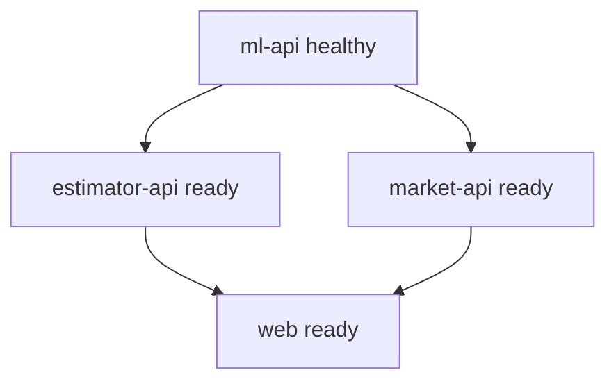

# 本地运行与部署

状态：四服务 Dockerfile 与根 Compose 已实现，并于 2026-08-15 完成本地构建、健康等待、浏览器、故障恢复、关闭和重启验收。

## 1. 本地基线

面试交付的可靠基线是 Docker Compose，而不是要求面试官分别安装 Python、Node 和 Java。

预计前置条件：

- Git。
- Docker Desktop 或兼容 Docker Engine，Compose v2。
- 可用端口 3000、8000、8001、8080。

本地直接开发可额外安装 ADR-004 冻结的 Python 3.12.13、Java 21、Node.js 24.18.0、pnpm 11.15.1 和 Maven Wrapper 3.9.16，但不是 Compose 演示的必要条件。

## 2. 启动命令

从仓库根目录执行：

```powershell
docker compose config
docker compose up --build -d --wait
docker compose ps
```

默认入口：Portal `http://localhost:3000`，ML Swagger `http://localhost:8000/docs`。复制 `.env.example` 为 `.env` 可覆盖宿主机端口和超时；不要把 `.env` 提交到 Git。

不能仅以进程存在判断成功；`--wait` 必须成功，且还需 API smoke 和浏览器验收。

## 3. 构建策略

- `ml-api`：在可复现构建阶段生成模型产物，运行镜像只加载。
- `estimator-api`：轻量 Python 镜像，不复制数据和模型。
- `market-api`：多阶段 Java 构建，运行镜像只包含可执行产物和只读 CSV。
- `web`：多阶段 Next.js 构建，服务端环境变量在运行时读取；不得把内部服务地址错误暴露到客户端。

## 4. Compose 依赖



使用 healthcheck 和有限启动等待，不依赖固定 sleep。

## 5. 环境变量

| 变量 | 使用者 | 默认/示例 | 说明 |
|---|---|---|---|
| `ML_API_BASE_URL` | Estimator、Market | `http://ml-api:8000` | ML 服务内网地址 |
| `ESTIMATOR_API_BASE_URL` | Web server | `http://estimator-api:8001` | Estimator 内网地址 |
| `MARKET_API_BASE_URL` | Web server | `http://market-api:8080` | Market 内网地址 |
| `ML_API_TIMEOUT_SECONDS` | 两个业务后端 | `5` | 下游总超时 |
| `WEB_API_TIMEOUT_SECONDS` | Web server | `10` | BFF/Server Component 后端总超时 |
| `ML_MODEL_PATH` | ML API | `/app/models/model.joblib` | 只读模型产物路径 |
| `ML_METADATA_PATH` | ML API | `/app/models/metadata.json` | 只读模型元数据路径 |
| `MARKET_DATA_PATH` | Market API | `/app/data/house-price-dataset.csv` | 容器内只读市场数据路径 |
| `MARKET_CACHE_TTL_SECONDS` | Market | `300` | Caffeine TTL |
| `MARKET_CACHE_MAX_ENTRIES` | Market | `256` | Caffeine 最大条目数 |
| `LOG_LEVEL` | 全服务 | `INFO` | 日志级别 |

Compose 内部地址固定使用服务发现；`.env.example` 仅作为可提交的非密钥覆盖模板。

## 6. Smoke 验证

至少验证：

- Web 首页返回 200。
- 三个后端 `/health` 返回预期状态。
- ML Swagger 可打开。
- 单条和批量预测成功。
- Market summary 返回 50 条基线数据。
- Estimator 页面提交成功。

PowerShell 快速检查：

```powershell
Invoke-RestMethod http://localhost:3000/api/ready
Invoke-RestMethod http://localhost:8000/health
Invoke-RestMethod http://localhost:8001/health
Invoke-RestMethod http://localhost:8080/health
Invoke-RestMethod http://localhost:8080/api/v1/market/summary
```

停止：

```powershell
docker compose down
```

该命令只移除本项目 Compose 容器与网络，不删除源文件或本地镜像。

## 7. 公网部署

公网部署为可选加分：

- 优先选择可以同时运行容器和 Java/Python 的平台，或分别部署服务。
- 使用 HTTPS、平台健康检查和受控 CORS/同源 BFF。
- 记录部署 commit、环境变量、区域和最后验证时间。
- 免费平台可能休眠；面试现场仍保留本地 Compose 兜底。

当前没有完成公网浏览器验收，只能写“本地验证通过”。

## 8. 常见排错顺序

1. 检查端口占用。
2. `docker compose config` 检查变量替换。
3. 查看 `docker compose ps` 健康状态。
4. 先验证 ML，再验证 Estimator/Market，最后验证 Web。
5. 用请求 ID关联服务日志。
6. 检查 CSV/model 是否存在且 SHA-256 正确。
