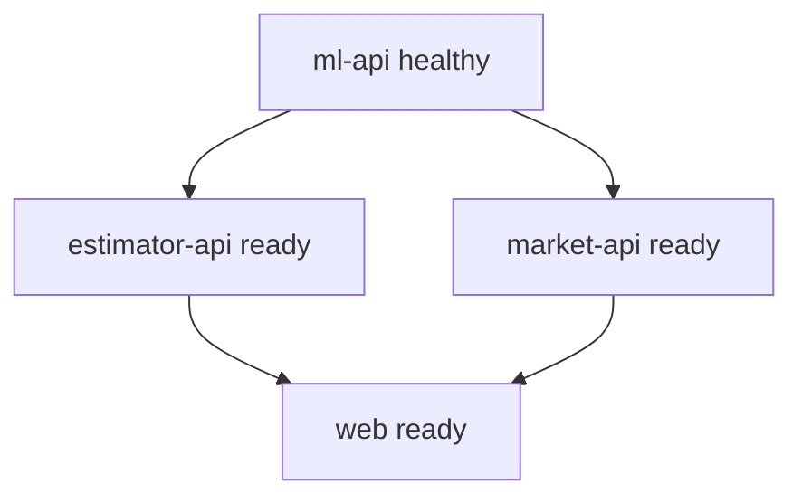

# 本地运行与部署设计

状态：计划，Compose 和 Dockerfile 尚未实现，以下命令当前不可执行。

## 1. 本地基线

面试交付的可靠基线是 Docker Compose，而不是要求面试官分别安装 Python、Node 和 Java。

预计前置条件：

- Git。
- Docker Desktop 或兼容 Docker Engine，Compose v2。
- 可用端口 3000、8000、8001、8080。

本地直接开发可额外安装 Python 3.12+、Java 21 和与选定 Next.js 兼容的 Node.js，但不是 Compose 演示的必要条件。

## 2. 计划命令

实现后 README 应验证：

```powershell
docker compose config
docker compose build
docker compose up -d --wait
docker compose ps
docker compose down
```

不能仅以 `docker compose up` 进程存在判断成功；还需 API smoke 和浏览器验收。

## 3. 构建策略

- `ml-api`：在可复现构建阶段生成模型产物，运行镜像只加载。
- `estimator-api`：轻量 Python 镜像，不复制数据和模型。
- `market-api`：多阶段 Java 构建，运行镜像只包含可执行产物和只读 CSV。
- `web`：多阶段 Next.js 构建，服务端环境变量在运行时读取；不得把内部服务地址错误暴露到客户端。

## 4. Compose 依赖



使用 healthcheck 和有限启动等待，不依赖固定 sleep。

## 5. 环境变量

| 变量 | 使用者 | 默认/示例 | 说明 |
|---|---|---|---|
| `ML_API_BASE_URL` | Estimator、Market | `http://ml-api:8000` | ML 服务内网地址 |
| `ESTIMATOR_API_BASE_URL` | Web server | `http://estimator-api:8001` | Estimator 内网地址 |
| `MARKET_API_BASE_URL` | Web server | `http://market-api:8080` | Market 内网地址 |
| `ML_API_TIMEOUT_SECONDS` | 两个业务后端 | `5` | 下游总超时 |
| `MARKET_CACHE_TTL_SECONDS` | Market | `300` | Caffeine TTL |
| `LOG_LEVEL` | 全服务 | `INFO` | 日志级别 |

实现时各运行时可以使用自己的变量前缀，但必须同步 `.env.example` 和本文档。

## 6. Smoke 验证

实现后至少验证：

- Web 首页返回 200。
- 三个后端 `/health` 返回预期状态。
- ML Swagger 可打开。
- 单条和批量预测成功。
- Market summary 返回 50 条基线数据。
- Estimator 页面提交成功。

## 7. 公网部署

公网部署为可选加分：

- 优先选择可以同时运行容器和 Java/Python 的平台，或分别部署服务。
- 使用 HTTPS、平台健康检查和受控 CORS/同源 BFF。
- 记录部署 commit、环境变量、区域和最后验证时间。
- 免费平台可能休眠；面试现场仍保留本地 Compose 兜底。

没有完成公网浏览器验收前，只能写“本地验证通过”。

## 8. 常见排错顺序

1. 检查端口占用。
2. `docker compose config` 检查变量替换。
3. 查看 `docker compose ps` 健康状态。
4. 先验证 ML，再验证 Estimator/Market，最后验证 Web。
5. 用请求 ID关联服务日志。
6. 检查 CSV/model 是否存在且 SHA-256 正确。

