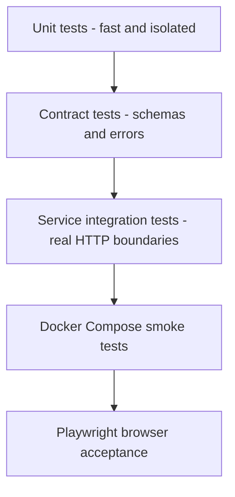

# 测试策略

## 1. 原则

- 测试必须覆盖真实风险：数据 schema、模型顺序、服务契约、下游失败、缓存键、浏览器状态和导出。
- 单元测试不能代替容器和浏览器验收。
- 每个关键结果都能追溯到源数据或明确计算。
- Phase 0B 工程基线、Phase 1 ML API 与 Phase 2 Estimator API 测试已运行；Market、Portal、Compose 和系统 E2E 测试仍为计划。

## 2. 测试层级

## 3. ML API

### 数据测试

- CSV 使用 BOM 安全编码读取。
- 训练列与预期完全一致。
- 行数 50，无缺失、无重复，`id` 唯一。
- `id` 不进入 Pipeline。
- 测试 CSV 特征集合与训练特征一致。

### 模型测试

- 固定数据与随机种子得到一致元数据和预测容差。
- Pipeline 输入顺序不可交换。
- 预测为有限正数。
- 元数据中的数据 SHA-256 与源文件一致。
- 交叉验证产生 R²、MAE、RMSE 均值和标准差。

内部质量警戒线，不是原题承诺：

- 交叉验证平均 R² 目标 `>= 0.95`。
- 平均 MAE 目标 `<= 15000`。
- 平均 RMSE 目标 `<= 20000`。

未达到时先排查数据、特征顺序和评估实现；不能删除失败测试或手填指标。

### API 测试

- 单对象、数组、空数组、101 条批次。
- 缺失字段、额外字段策略、字符串、NaN/Infinity、越界评分。
- 轻微训练范围外输入返回 warning 而非错误。
- 模型丢失/损坏时 health/readiness 和预测行为正确。

## 4. Estimator API

- 正确转发全部 7 个字段。
- 保留 ML 响应顺序、模型版本和 warnings。
- 映射 ML 422、502、503、504。
- 超时配置实际生效。
- 请求 ID 跨服务传播。
- 测试既包含 mock ML，也包含真实 ML 容器集成。

## 5. Market API

### 统计对账

未筛选基线至少核对：

- `count = 50`
- `average_price = 264600`
- `median_price = 245000`
- `min_price = 160000`
- `max_price = 410000`
- `average_square_footage = 1690.2`

### 行为

- 单条件、多条件、边界和空结果筛选。
- 分页无 off-by-one，排序仅允许白名单。
- 不同参数产生不同缓存键；等价参数顺序产生相同键。
- TTL 和最大容量生效。
- what-if 一次调用 ML 批量预测 baseline/scenario，结果差计算正确。
- CSV 行数/列头/公式注入保护。
- PDF 页数大于 0、可提取标题和筛选条件、渲染无截断。

## 6. Web

### 组件测试

- 字段标签、单位、默认示例和错误摘要。
- 货币和数值格式化。
- loading、empty、error、retry 状态。
- localStorage schema 迁移、条数限制和清空确认。
- Compare 选择上限和移动布局。

### 浏览器 E2E

- 使用 Docker Compose 中的真实后端。
- 检查 DOM、截图、console 和 network。
- 360x800 与 1280x800 视口。
- 键盘完成 Estimator 主流程。
- 下载 CSV/PDF 并检查文件内容。
- 停止 ML 服务，验证错误与恢复。

建议工具：Playwright；可访问性使用 axe 或等价工具。精确版本在批准后的 Phase 0B 锁定。

## 7. 契约测试

- FastAPI/Spring 生成 OpenAPI 与仓库快照比较。
- TypeScript 类型从快照生成。
- 业务后端对 ML API 使用固定成功/失败 fixtures。
- 错误代码、字段路径和 request ID 不允许无意漂移。

## 8. Compose 验收

1. 清理旧容器与端口冲突。
2. 从无缓存或明确记录缓存条件的构建开始。
3. 等待 health/readiness。
4. 执行 API smoke。
5. 执行浏览器 E2E。
6. 保存测试摘要和关键截图。
7. 停止并确认无残留异常容器。

## 9. 证据记录

每次最终验收记录：

- Git commit SHA。
- 操作系统和 Docker 版本。
- 执行命令。
- 通过/失败/跳过数量。
- 浏览器与视口。
- 未执行边界，例如公网部署。
